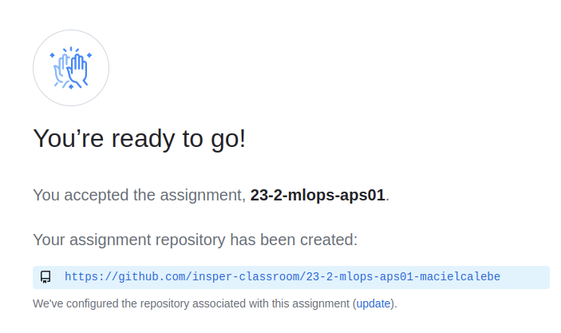
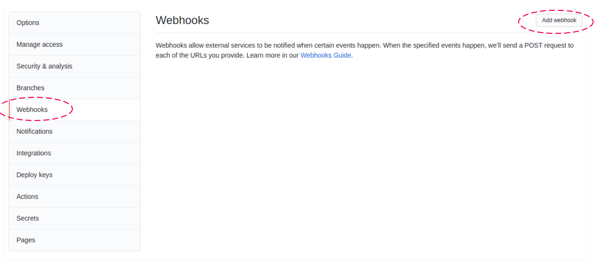
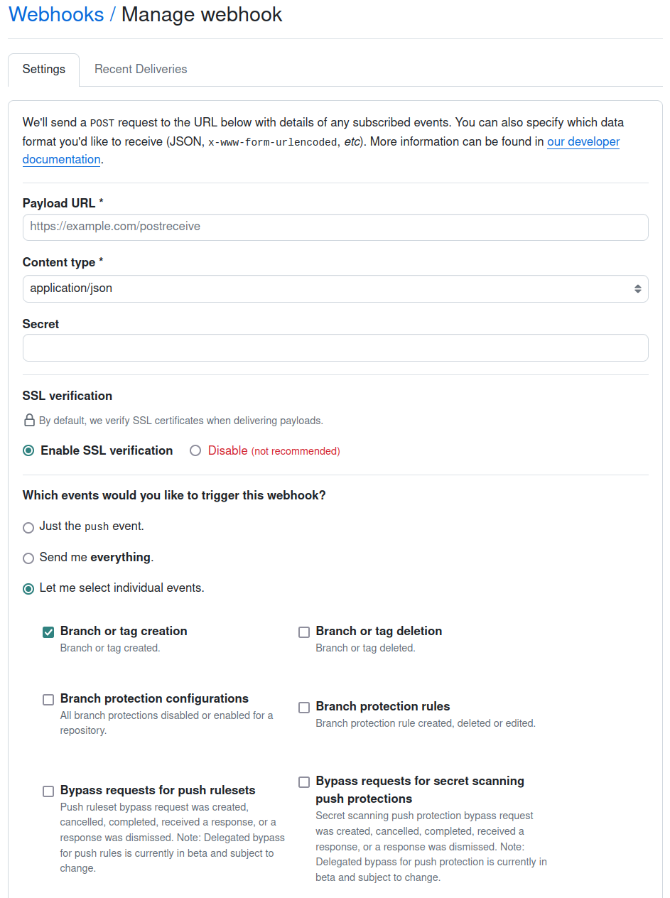
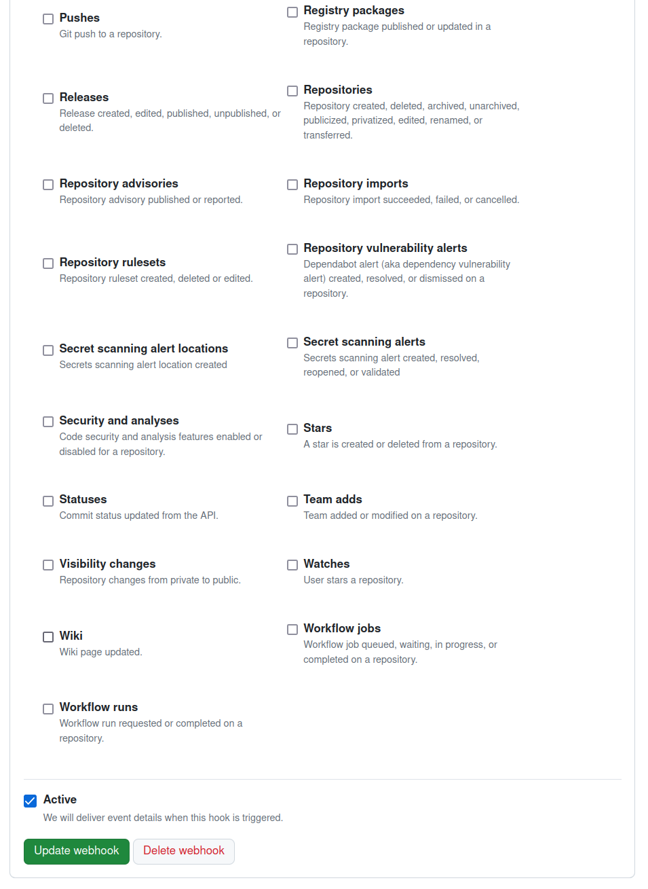

# Standards - Aps01 - Part 1

What is the size of a Data Science team? Considering data analysts, data engineers, data scientists, machine learning engineers, it is not uncommon for the professional count to reach hundreds. Across industries, companies are building [larger data science teams](https://www.statista.com/statistics/1136560/data-scientists-company-employment/) more and more.

So let's assume that the odds are high that you won't work alone on a data team. Imagine if each professional developed their models in a completely different way, without any:

- Language standards
- Libraries standards
- Code organization standards
- Concerns about the resources needed to deploy the models.

It is certain that this team will have difficulties in generating business value from ML!

In this activity, we will work on producing a **repository template**, defining standars that should be used on future projects. Let's assume that git is used for code versioning.


## Accept assignment

All assignments delivery will be made using Git repositories. Access the link below to accept the invitation and start working on the first assignment.

[Invitation link](https://classroom.github.com/a/Gg947NZN){ .ah-button }

!!! important
    You should have received a new private repository. Copy your repo address below. It will be used in the rest of the guide.

    

!!! danger "Atention"
    Please note that **APS 01** is divided into **two assignments**! The link to the second part will be available later in the **part 2** handout!

## Configure assignment repository

The supporting code for this activity is public in the repository [APS 01 MLOps](https://github.com/insper-classroom/mlops-aps01-marketing). In this guide we will configure your private repository to go along with this public repo.

To get started, create a new folder for your delivery repository and initialize an empty repo:

<div class="termy">

    ```console
    $ mkdir aps01
    $ cd aps01
    $ git init
    ```

</div>

First let's add the remote repository of support files and download the `main` branch (which contains this semester's files)

<div class="termy">

    ```console
    $ git remote add insper https://github.com/insper-classroom/mlops-aps01-marketing
    $ git fetch insper
    $ git checkout main
    ```

</div>

Now let's add the repository of your assignment and send the support code:

<div class="termy">

    ```console
    $ git remote add aps your_private_repo_addresss
    $ git push --set-upstream aps main
    ```

</div>

With that you should already have your local repository configured and pointing to two remote repositories:

- **insper**: this repo contains all support code for **aps01**. It is shared across the room and no one is allowed to push it.
- **aps**: this repo is yours alone and contains your work only. It will have only the modifications made by you.

You can check that everything worked by running `git branch -avv`.

Let's start by downloading the news from the support repository:

<div class="termy">

    ```console
    $ git fetch insper
    ```

</div>

Let's then embed the news in your local repository and push the new files to your private repo.

<div class="termy">

    ```console
    $ git switch main
    $ git merge insper/main
    $ git push
    ```

</div>

## Configure dev environment

Use a tool of your preference to create an isolated Python environment.

### With `conda`

<div class="termy">

    ```console
    $ conda create -n mlops python=3.10
    $ conda activate mlops
    ```

</div>


### With `venv`

- On Windows:
<div class="termy">

    ```console
    $ python3 -m venv mlops
    $ mlops\Scripts\activate
    ```

</div>

- On Linux/macOS:

<div class="termy">

    ```console
    $ python3 -m venv mlops
    $ source mlops/bin/activate
    ```

</div>

<br>

!!! Danger "Important!"
    Remember to add your **env** folder (`mlops` in the example) to `.gitignore`

## Task 01: Opening

Check the content of the `aps01` repository. Install the notebook package of your preference and open the notebook.

<div class="termy">

    ```console
    $ pip install jupyter
    ```

</div>

You you notice that everything was done in a single notebook. Data proccessing, analysis, model construction, etc.

There are those who defend the software production inside notebooks. There is even the area of **NDD** ([Notebook-Driven Development](https://github.com/fastai/nbdev)). It works when done right, but let's stay away from these people and take a more classical approach!

## Task 02: Organizing

Now you must configure the repository according to some standards. Let's create specific folders for each type of resource used in the project.

Think that all the repositories of the company should follow this organization pattern.

!!! exercise "Question"
    Let's organize the **data** resources. You must:

    1. Create a folder called `data`
    1. Move data files to this folder

!!! exercise "Question"
    For **notebooks**:

    1. Create a folder called `notebooks`
    1. Move notebook files to this folder

## Task 03: Split notebook code

Every code on this project is on a single notebook. We are going to split it considering the different functionalities provided.

!!! exercise "Question"
    Now you must:

    1. Create a folder called `src`
    1. Create a file `src/proccess.py` with all necessary code for data preprocessing. This code can generate a separeted file inside `data`.
    1. Create a folder called `models`
    1. Create a file `src/train.py` with all necessary code for model training. This code should export models to folder `models`.

Leave in the notebook only code for data exploration.

## Task 04: Prediction

Once the training algorithm, features and hyperparameters have been chosen, the final model to be deployed can be trained with a more complete set of data (and not just `X_train`). We will ignore this fact for now!

Also, when the model is in use (making predictions), the target variable is not needed or does not exist. That is, we need specific data and scripts for prediction.

In this activity, consider that whenever training needs to be redone, there will be a `bank.csv` file with updated data in the `data` folder.

!!! exercise "Question"
    Let's simulate the prediction data. Now you must:

    1. Copy the `data/bank.csv` file to a new `data/bank_predict.csv` file. This new file must not have the **target** column
    1. Create a file `src/predict.py` with all necessary code for making predictions on file `data/bank_predict.csv`. You should use the **pickle** files of the models.
    1. Create a new column `y_pred` on file `data/bank_predict.csv` with the prediction of your model mapped to `"yes"` or `"no"`.

At this point, you have a repository:
- With well-organized folders
- With specific code files to train a model
- With specific code files to use a model to make predictions

## Task 05: Readme

!!! exercise "Question"
    Create a `README.md` with some basic informations of the project

## Task 06: Dependencies

!!! exercise "Question"
    Create a `requirements.txt` with all the libs used on the project.


!!! exercise choice "Question"
    Should you set lib versions?

    - [X] Yes
    - [ ] No

    !!! answer "Answer"
        In production deployment, it's a good idea to track dependencies to maintain stability and reliability. Besides that, in some companies your will run in a cluster (spark) where all data scientists and machine learning engineers must to use the same library versions.

!!! info "Important!"
    From now on, we will develop part 02 of APS 01!

## Release APS01 Part 1!

It looks like you have completed the activities for the first part of the APS, so it's time to do the release!

In this APS, we will use an automatic correction server.

### Webhook configuration

Go to the activities repository on GitHub and access the settings (e.g., https://github.com/insper-classroom/24-2-mlops-aps01-pedrods/settings). In the left menu, choose the **Webhooks** option and then the **Add webhook** option.



You will need to fill in:

- Payload URL: `http://xxxx.com/yyy` **Go to Blackboard to get the URL!**
- Content type: `application/json`
- Secret: leave it empty!
- SSL verification: check `Enable SSL verification`
- Which events would you like to trigger this webhook?: Choose `"Let me select individual events"` and then:
    - Check ONLY the OPTION:
        - `Branch or tag creation`
    - Uncheck the OPTION:
        - `Pushes`
- Finally, leave the `Active` option checked.


[...]


With this, your repository can now be tested automatically!

### Test Release

With the repository cloned on your machine, open the terminal and launch any tag.

!!! info "Info!"
    We will (intentionally) launch a tag for a non-existent activity!

Now, open the terminal in the root of the repository and type the following commands:

<div class="termy">

    ```console
    $ git add .

    $ git commit -m "my cs repository"

    $ git push

    $ git tag -a aps99.1.1 -m "test tag"

    $ git push origin aps99.1.1
    ```

</div>

### Go to your repository
Access the issues tab of your repository on GitHub. You should find a response from the test, informing you that the activity does not exist!


Click on the issue to see an example of automatic feedback.


!!! info "Info!"
    The creation of the issue indicates that our tag creations are triggering the test server!

### Now, for real!

!!! tip "Tip!"
    If you need to create a new tag, increase the last number:

    - `aps1.1.2`
    - `aps1.1.3`

<div class="termy">

    ```console
    $ git tag -a aps1.1.1 -m "test tag"

    $ git push origin aps1.1.1
    ```

</div>
<br>

!!! exercise "To do!"
    Check the repository for issues!

### Update `README.md`

Now we will update the `README.md` to show the current status of the tests in your repository. Edit your `README.md` and add an API call at the beginning, providing your GitHub username.

!!! danger "Attention!"
    Access Blackboard to find the API arguments!

```console
## Status dos testes


```

An Example:


